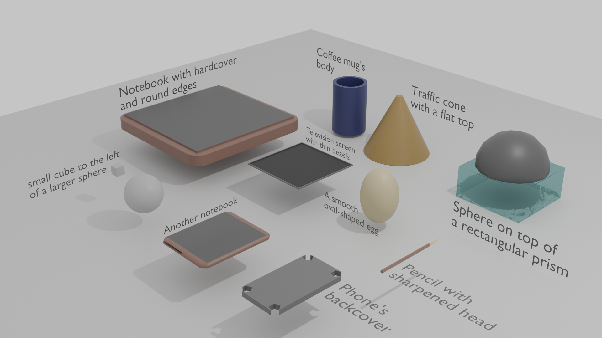

# Independent Study Option
ShapeCraft: an LLM Multi-agent Pipeline for Synthesizing 3D Shape Programs

### Getting started

Install dependencies in a python (recommanded 3.10.16) environment: 
- `pip install -r requirements` for all dependencies

### Files of interest

Running experiments:
- `exp_1_loop.py`: Single Run with Python + Blender
- `exp_full.py`: Full Pipeline with Python + Blender
- `exp_scad_single.py`: Single Run with OpenSCAD
- `exp_scad_full.py`: Full Pipeline with OpenSCAD

Visualization:
- `vis_single.py`: examining single run method results folder (can work with full pipeline too, just click into them)

Evaluation:
- `eval_clip.py`: aggregate and plot clip similarities
- `eval_vlm.py`: aggregate and plot vlm evaluations
- `eval_for_table.py`: aggregate results and print as pretty tables
- `eval_utils.py`: count OBJ faces and vertex
- `evalexp_iterations.py`: check for improvements over iterations

Auxiliary:
- 
