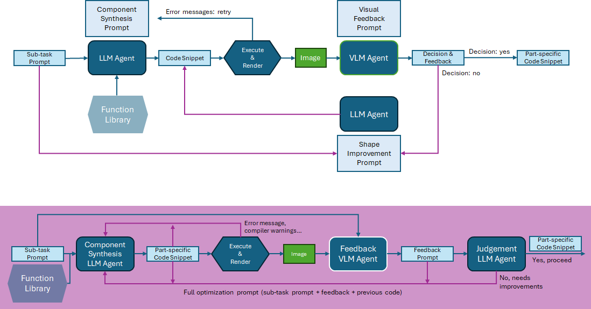

# visual feedback loop update

visual feedback agent may be able to make judgement already, and improving existing code need a different prompt. 

Planned updates: 
component synthesis -> visual feedback (makes decision too)
    -> component improvement agent
remove: component judgement agent

Updated pipeline vs old: 


example visual feedback agent output:
```markdown
# Visual Feedback Instruction

**Objective:** Given a rendered image of a 3D shape, analyze it against the target shape description and provide feedback on:
1. Consistency between the visual output and the sub-task intent.
2. Specific discrepancies or areas for improvement.
3. Suggestions for refining the corresponding code snippet.

**Output Format:**
- Issues: [Detailed description of any issues]
- Consistency: [Yes/No based on issues identified]
- Suggestions: [Improvement suggestions if any]

# Shape Description
An upright, rectangular shape that connects to the rear of the chair seat. It should be taller than the seat and have a slight incline for ergonomic support. The edges can be rounded to match the style of the seat.
- **Issues:** The shape appears to be a rectangular block, but it does not show a clear incline, which is essential for ergonomic support. Additionally, while the edges are rounded, the overall shape seems somewhat bulky and lacks the definition of being taller than a typical chair seat. The rear connection to the chair seat isn't evident in the image, which is crucial for functionality.

- **Consistency:** No

- **Suggestions:**
  1. **Incorporate an Incline:** Modify the shape to include a slight backward tilt to enhance the ergonomic support.
  2. **Adjust Proportions:** Ensure that the shape is proportionally taller than the seat to create a more visually appealing and functional design.
  3. **Refine Connection Points:** Add clear connection geometry to illustrate how this shape integrates with the chair seat, ensuring it appears as part of the overall chair structure.
  4. **Smoothing Modifier:** Consider applying a smoothing modifier to achieve a more visually refined surface, emphasizing ergonomic characteristics.
```

Note: 
some feedbacks are not necessary and may introduce extra code, may result in non-converging loops
- potentially we can adjust the prompt and make it only highlight significant discrepencies
- or we can further divide the pipeline: 
    - first significant changes, then next step is to refine local details
