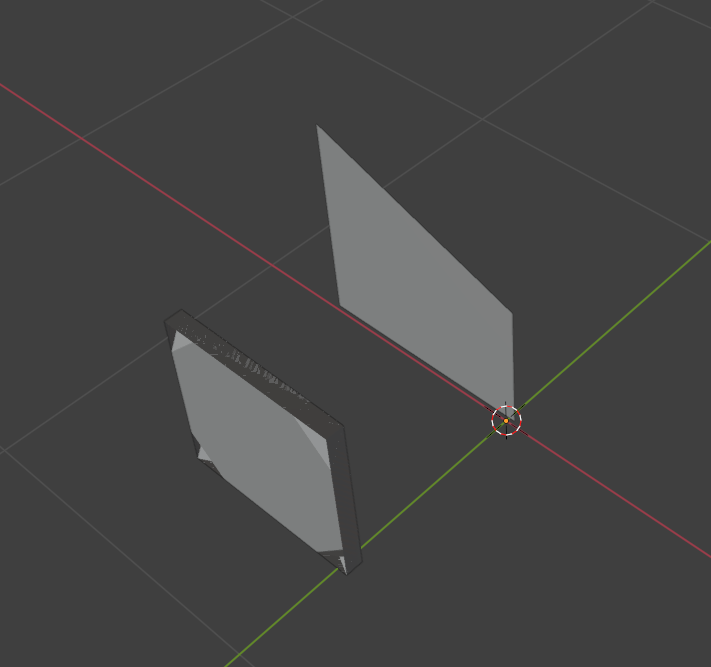

promtps all finished and unit tested however

- visual loops not tested together
- agent wrappers not implemented, need framework implementation for automated testing
- code-level integration definitely needs visual feedback loop
    - code integration context length is so long
- does sub-component synthesis need visual feedback loop?
    - altho we can tolerate some local discrepancies, it's better if we mitigate them
    - con is it might be updated in the wrong direction
        - verify it with multi-view visual feedbacks

maybe potential to extend (improve) it to procedural methods for component synthesis
- comp synth + func extra to proc model methods
- code integration only need to call functions and adjust parameters, instead of working with low-level shapes themselves

can find some dataset and metric to test some baselines / ablation study:
- GPT-4o to generate whole shape
- GPT-4V to generate whole shape with feedback loops
- current pipeline with direct code-level integration
- proposed update with procedural methods

can first test procedural method generation on simple shapes (e.g. for sub-components)

current full run without feedback loop causes errors and wrong results: 

