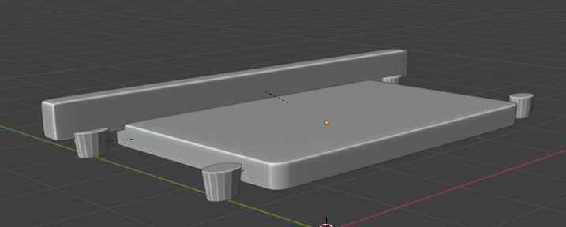

# initial testing
model: GPT-4o-mini
task: task-decomposition and component-synthesis

Task decomposition works well after some tuning as expected. 

For shape synthesis, some considerations on LLM capability to generate functional blender python code almost lead to choosing OpenSCAD as shape engine due to simplicity, thus the support for switching coding lang and shape engine was added to component synthesis prompt (`config.yaml`)

Using shape description from task_decomp's output (namely chair backrest):
```
An upright, rectangular shape that connects to the rear of the chair seat. It should be taller than the seat and have a slight incline for ergonomic support. The edges can be rounded to match the style of the seat.
```
GPT-4o-mini API call successfully generates the following fine shape: 


with the following code:
```python
import bpy
import bmesh

def create_backrest():
    # Define dimensions
    width = 0.5
    depth = 0.1
    height = 0.7
    incline_angle = 15  # degrees

    # Create a new mesh
    mesh = bpy.data.meshes.new("Backrest")
    obj = bpy.data.objects.new("Backrest", mesh)

    # Link the object to the scene
    bpy.context.collection.objects.link(obj)

    # Create a bmesh for the backrest
    bm = bmesh.new()

    # Create vertices for the rectangular backrest with incline
    v1 = bm.verts.new((-width / 2, -depth / 2, 0))
    v2 = bm.verts.new((width / 2, -depth / 2, 0))
    v3 = bm.verts.new((width / 2, depth / 2, 0))
    v4 = bm.verts.new((-width / 2, depth / 2, 0))

    v5 = bm.verts.new((-width / 2, -depth / 2, height))
    v6 = bm.verts.new((width / 2, -depth / 2, height))
    v7 = bm.verts.new((width / 2, depth / 2, height - height * (incline_angle / 90)))
    v8 = bm.verts.new((-width / 2, depth / 2, height - height * (incline_angle / 90)))

    # Create faces
    bm.faces.new((v1, v2, v6, v5))
    bm.faces.new((v2, v3, v7, v6))
    bm.faces.new((v3, v4, v8, v7))
    bm.faces.new((v4, v1, v5, v8))
    bm.faces.new((v5, v6, v7, v8))
    
    # Round edges (bevel)
    bmesh.ops.bevel(bm, geom=bm.verts[:], offset=0.05)

    # Finish the mesh
    bm.to_mesh(mesh)
    bm.free()

# Call the function to create the backrest
create_backrest()
```

The code quality is exceeding expectations, at least far better than GPT-3.5 tested half a year ago (but not exact shapes, on generating shape programs), thus the doubt if this project is still reasonable. 

Testing the same with GPT-4o manually with task_decomp's prompt on chair's all components yield, thankfully, sub-optimal results: 



Now this is similar performance to GPT-3.5's test on shape program synthesis, where connecting each component is problematic, suffering from its one-run reasoning. Thus the hope to still improve it with our pipeline and specifically, visual feedback loops. 

Next step should also include automation of result visualization in Blender. We could use my previously implemented [collection renderer](https://github.com/SanBingYouYong/Blender-Auto-Renderer)'s automatic adjusting render ability. 
